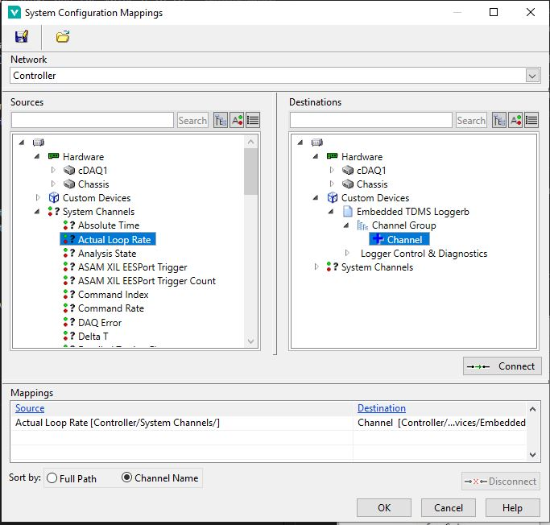
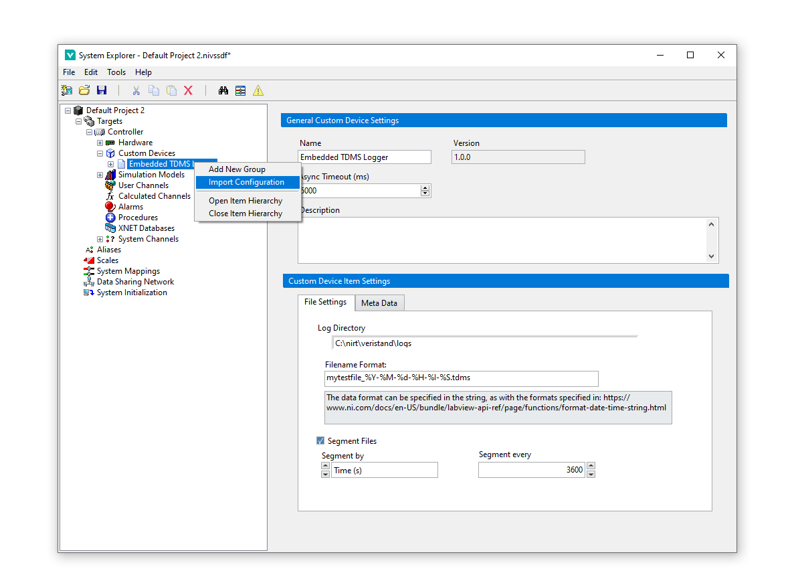
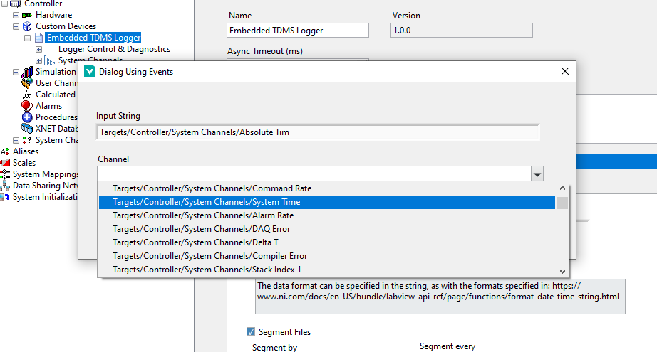

# Embedded TDMS Logger

## Overview

The Embedded TDMS Logger Custom Device is a plugin for logging data directly on the real time system of a VeriStand target, logging both Waveform and Channel data into one TDMS file with the flexibility to control the logged meta data.

## Software Dependencies

- NI LabVIEW 2023 Development Environment or later
- NI VeriStand 2023 or later
- VeriStand Development Tools VIPC

## Features

- Ability to control the meta data logged into the TDMS file at the file, group and channel level.
- Ability to log both waveform and single point channels.
- Ability to decimate channel data to reduce file sizes.
- Control of the grouping of channels within the TDMS file
- Control to segment files either by size or time
- Triggering functionality (re-triggerable)
- Can log immediately upon deployment (setup trigger to have a default value greater than zero).
- Ability to name files based on the time as formatted, specified by the user.

## Build Availability

Users are encouraged to build this code using the Build Specifications within the LabVIEW project(s). However certain releases will be made, corresponding to our internal setup and LabVIEW/VeriStand versionings.

### Installing

You can install the Custom Device by building the build specifications above or referring to releases available in this repository, downloading and extracting the zip release into C:\Users\Public\Documents\National Instruments\NI VeriStand 2024\Custom Devices

### Pre-requisities to install for building:

- Caraya Unit Test Framework through VIPM
- [NI VeriStand Custom Device Inline Async API](https://github.com/ni/niveristand-custom-device-inline-async-api/releases)
- [HTML Help File Tools](https://github.com/NIVeriStandAdd-Ons/HTML-Help-File-Tools/releases/tag/v1.0.0.13)
- [HTML Help Workshop](https://www.helpandmanual.com/downloads_mscomp.html)
- LabVIEW, LabVIEW Real Time, LabVIEW Application Builder (All licensed).
- VeriStand and VeriStand Custom Devices
- [VeriStand Import Export Tool](https://github.com/NIVeriStandAdd-Ons/VeriStand-Addon-CD-Import-and-Export-Tool/releases/tag/v1.0.0.11)
- [Advanced System Definition API](https://github.com/NIVeriStandAdd-Ons/VeriStand-Addon-System-Definition-Utilities/releases/tag/v1.1.1.21)

## Support

This custom device has been created by UKAEA for a project within the organisation. We do not intend to officially support this and are publishing it to the wider community as it is seen as a beneficial outcome not only internally but for wider use by VeriStand users.

## Quality, Limitations

The segment by size uses the file size before it is defragmented which happens when you untrigger or the segmentation takes effect. This means you may select to segment every 50MB but instead get files in sizes of 35MB - we are yet to find a solution to this.

We only log in TDMS format and no other format however you can open this in Excel with a plugin or use python scripts to convert/read/process the file data.

If you want to see the data on the host, you can manually transfer this to the host via FTP or WebDAV. We recommend to set up a mapped drive on the host of the WebDAV location on the target so the two are mirroring each other.

The overall reason for the production of this custom device is to produce one file, regardless of logging waveforms or channels, doing this losslessly (as best as is possible) on the RT without the possibility of networking disruption causing data loss.

There is currently no support for exporting configurations, only importing.

## Large Configurations

For large systems/setups we have developed a way of importing a configuration from a CSV file which will automatically map channels to their custom device channels and select the waveforms.

The format of said CSV should be:

| Group Name | Channel Name | Is Wfm? | Units | Source                                            | Decimation | Additional Meta Data | ... |
|------------|--------------|---------|-------|---------------------------------------------------|------------|----------------------|-----|
| Group 1    | Channel 1    | No      | Volts | Targets/PXI/Hardware/Chassis/.../Analog Input/AI0 | 2          |                      |     |
...
...
...

Is Wfm should identify whether the channel you intend to read is a waveform channel or double channel in VeriStand itself. The Source should be the channels full path in VeriStand. Units, Decimation, Channel Name, Group Name are also required. The columns must be in this order and the CSV should be comma seperated. Decimation cannot be less than 1 or a decimal value. Additional Meta Data is where, any columns that exist after decimation, the column header name is used as the meta data key for every channel and then the channel's row value is the meta data's corresponding value. For example, the column header could be Range and the value 0-10 to tell us that Channel 1 is measuring 0-10 Volts.

We developed this method in house because our signal list was relatively large and subject to changes in an Excel workbook which could be time consuming for large changes.

If the Source is not correctly identified by the custom device, a pop-up will appear with the possible options for the selected waveforms/channels. Once the configuration has been successfully imported, the Source column is overwritten with the found working paths so you need not update/fix it afterwards within your CSV definition, infact you can leave this blank and configure it in VeriStand but for large configurations that can be time consuming for the first run as well.

**Note: large configurations will result in the graphical display of the system definition being slow to re-render after changes are made to the system definition as single point channels are linked to the custom device via mappings.**

## Using the custom device

Create the new custom device as you would any other. Right click the custom device to the start creating groups and subsequently right click those groups to create channels, waveform channels should be selected if you intend to log a waveform directly.

### Connecting Waveform Channels

When connecting your waveform channel to be logged, go to your waveform channel's page and select the channel from the dropdown:

### Connecting VeriStand Channels:

Normal VeriStand Channels are connected to their source data through mappings:

### Importing a configuration

To import a configuration as with the above described CSV, once you have developed your CSV file, right click the custom device root and select "Import Configuration", at the file dialog prompt, select your CSV. 

A prompt window will appear for any channels defined in the CSV it is unable to locate, locate these in the drop down menu and click Okay to identify them correctly with the custom device. After this process, your CSV file will be updated with the correctly found channel paths and future imports should not see this issue unless new channels are added or those specific channels have had path changes.

**Note: See Documentation\example_configuration.csv for an example of how the CSV should be defined**

### Export Configuration

You can also export the configuration to an XML based definition, this is also then re-importable as an XML format and can be useful for automated tasks.

### Diagnostics

There are 2 channels under the Logger Control and Diagnostics, Error Code for feedback as to how the custom device is performing, Triggered/Logging to confirm that logging is taking place.

**Note: When you import a configuration, you may need to reconnect these 3 channels in your VeriStand UI Screen if you are monitoring these.**

## Additional:

- You can setup multiple loggers at once.
- The Decimation of the custom device itself is not configurable, it is an asynchronous custom device so should not impact performance of the main PCL.
- This custom device supports enabling and disabling.